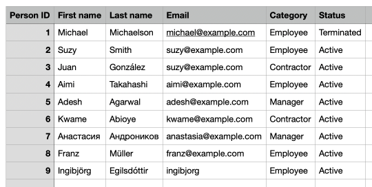
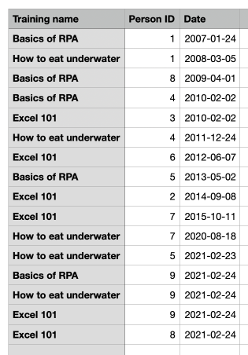
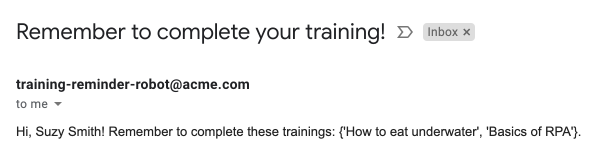

# Employee training reminders robot

> **Accessing Excel files with Robocorp is much more convenient, faster, and robust than interacting with the Excel application UI.** No Excel licenses or installation required. No flaky UI surface automation. Benefit from all the power and flexibility of the Python ecosystem!

## Background story

Acme Corporation requires employees to complete the required training. The employee and training information is stored in a highly-sophisticated HR solution: Excel files!

### Employees

The `employees.xlsx` Excel file contains all the people working for Acme Corporation. There are active and inactive employees, contractors, and managers. Each person has a unique identifier (`Person ID`).

| Person ID | First name | Last name  | Email               | Category | Status     |
| --------- | ---------- | ---------- | ------------------- | -------- | ---------- |
| 1         | Michael    | Michaelson | michael@example.com | Employee | Terminated |
| ...       | ...        | ...        | ...                 | ...      | ...        |



### Trainings

The `trainings.xlsx` Excel file tracks the training information. Every time an active employee completes a training, a new row is added to the file. The `Person ID` is used to refer to the person in the `employees.xlsx` file.

| Training name | Person ID | Date       |
| ------------- | --------- | ---------- |
| Basics of RPA | 1         | 2007-01-24 |
| ...           | ...       | ...        |



### The process

Jane from HR sends weekly reminders to active employees who have not completed all the training. Managers and contractors are not required to take the training. Reminding people is a fully manual process, and to be honest, quite dull.

### Example training reminder email

> Hi, Suzy Smith! Remember to complete these trainings: {'How to eat underwater', 'Basics of RPA'}.



## The automation

This Python robot automates the training reminder process:

- Reads the employee and training data from the Excel files. No Excel application required! **Accessing the Excel files is much more convenient, faster, and robust than interacting with the Excel UI.**
- Finds the active employees (`Category` = `Employee`, `Status` = `Active`).
- Sends an email reminder to all employees who have not completed all the required training.

The robot is built on top the [open source stack
for simplifying automation by Robocorp](https://robocorp.com/).

The robot consists of some configuration files (provided by the automation stack) and some Python files (implemented by the automation developer).

### `task.py`

```py
import os
import emailer
from RPA.Excel.Files import Files
from RPA.Tables import Tables

EMPLOYEES_EXCEL_PATH = os.environ["EMPLOYEES_EXCEL_PATH"]
TRAININGS_EXCEL_PATH = os.environ["TRAININGS_EXCEL_PATH"]
excel = Files()
tables = Tables()


def send_training_reminders():
    employees = get_active_employees(EMPLOYEES_EXCEL_PATH)
    trainings = read_excel_as_table(TRAININGS_EXCEL_PATH)
    send_reminders(employees, trainings)


def get_active_employees(excel_path):
    employees = read_excel_as_table(excel_path)
    tables.filter_table_by_column(employees, "Status", "==", "Active")
    tables.filter_table_by_column(employees, "Category", "==", "Employee")
    return employees


def read_excel_as_table(excel_path):
    try:
        excel.open_workbook(excel_path)
        return excel.read_worksheet_as_table(header=True)
    finally:
        excel.close_workbook()


def send_reminders(employees, trainings):
    for employee in employees:
        not_completed_trainings = get_not_completed_trainings(
            employee, trainings)
        if not_completed_trainings:
            send_reminder(employee, not_completed_trainings)


def get_not_completed_trainings(employee, trainings):
    trainings_copy = tables.copy_table(trainings)
    training_names = set(tables.get_table_column(
        trainings_copy, "Training name", as_list=True))
    tables.filter_table_by_column(
        trainings_copy, "Person ID", "==", employee["Person ID"])
    completed_trainings = set(tables.get_table_column(
        trainings_copy, "Training name", as_list=True))
    not_completed_trainings = training_names.difference(completed_trainings)
    return not_completed_trainings


def send_reminder(employee, not_completed_trainings):
    name = f"{employee['First name']} {employee['Last name']}"
    recipient = employee["Email"]
    subject = "Remember to complete your training!"
    body = (
        f"Hi, {name}! "
        f"Remember to complete these trainings: {not_completed_trainings}."
    )
    emailer.send_email(recipient, subject, body)


if __name__ == "__main__":
    send_training_reminders()

```

The robot reads the Excel file paths from environment variables using the [`os.environ`](https://docs.python.org/3/library/os.html#os.environ) function from the [Python Standard Library](https://docs.python.org/3/library/).

The [`RPA.Excel.Files`](https://robocorp.com/docs/libraries/rpa-framework/rpa-excel-files) library can read and manipulate Excel files directly. **You don't need to have the Excel application installed at all!** The robot uses this library to read the employee and training information from the Excel files.

The robot uses the [`RPA.Tables`](https://robocorp.com/docs/libraries/rpa-framework/rpa-tables) library to read and filter the data (finding the active employees, collecting all the training names).

### `emailer.py`

```py
from RPA.Email.ImapSmtp import ImapSmtp
from RPA.Robocloud.Secrets import Secrets

secrets = Secrets()
secret = secrets.get_secret("emailCredentials")
gmail_account = secret["username"]
gmail_password = secret["password"]


def send_email(recipient, subject, body):
    mail = ImapSmtp(smtp_server="smtp.gmail.com", smtp_port=587)
    mail.authorize(account=gmail_account, password=gmail_password)
    mail.send_message(
        sender=gmail_account,
        recipients=recipient,
        subject=subject,
        body=body,
    )

```

The `emailer.py` implements the email integration. The [`RPA.Email.ImapSmtp`](https://robocorp.com/docs/libraries/rpa-framework/rpa-email-imapsmtp) library provides the emailing functionality.

The [`RPA.Robocloud.Secrets`](https://robocorp.com/docs/libraries/rpa-framework/rpa-robocloud-secrets) library handles fetching the email credentials in a secure way.

## Configuration

You need to provide your Gmail credentials so that the robot can log in.

> See [How to work with email using Gmail and RPA Framework](https://robocorp.com/docs/development-guide/email/sending-emails-with-gmail-smtp) for how to configure Gmail for robot access.

### Create a `vault.json` file for the credentials

Create a new file: `/Users/<username>/vault.json`

```json
{
  "emailCredentials": {
    "username": "YOUR-GMAIL-USERNAME",
    "password": "YOUR-GMAIL-APP-SPECIFIC-PASSWORD"
  }
}
```

### Point `devdata/env.json` to your `vault.json` file

```json
{
  "RPA_SECRET_MANAGER": "RPA.Robocloud.Secrets.FileSecrets",
  "RPA_SECRET_FILE": "/Users/<username>/vault.json"
}
```

## I want to learn more!

Visit [Robocorp docs](https://robocorp.com/docs/) to learn more about developing Python robots to automate your processes!

[Robocorp portal](https://robocorp.com/portal/) contains many example robots with all the source code included.

Follow the [Robocorp YouTube channel](https://www.youtube.com/Robocorp) for automation-related videos.

Visit the [Software Robot Developer forum](https://forum.robocorp.com/) to discuss all-things automation. Ask questions, get answers, share your robots, help others!
